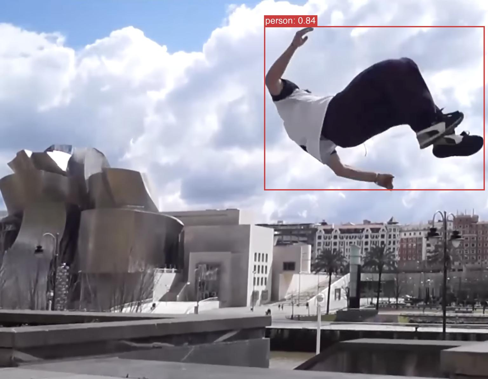

# LibreYOLO

> **v1.1 released!** New model families (YOLO-NAS, D-FINE, RT-DETR), instance segmentation, ByteTrack tracking, video inference, and a brand-new CLI. [See the release notes](https://github.com/LibreYOLO/libreyolo/releases/tag/v1.1.0).

[](https://www.libreyolo.com/docs)
[](https://pypi.org/project/libreyolo/)
[](LICENSE)

MIT-licensed object detection library with training and inference support across YOLOv9 (`t`, `s`, `m`, `c`), YOLOX (`n`, `t`, `s`, `m`, `l`, `x`), YOLO-NAS (`s`, `m`, `l`), RF-DETR (`n`, `s`, `m`, `l`), and D-FINE (`n`, `s`, `m`, `l`, `x`).



## Installation

```bash
pip install libreyolo
```

For optional runtime and export dependencies such as ONNX Runtime, OpenVINO, TensorRT, NCNN, and RF-DETR, see the full docs.

## Inference Backend and Export Support

### Format Status

| Format | Export | Runtime backend | Status | Precision | Notes |
|--------|--------|-----------------|--------|-----------|-------|
| ONNX | Yes | ONNX Runtime | Supported | FP32, FP16 | Release-blocking export path and the broadest tested runtime target. |
| TorchScript | Yes | PyTorch JIT | Experimental | FP32, FP16 | Useful compatibility target, but not a release gate. |
| TensorRT (`tensorrt` / `trt`) | Yes | TensorRT | Experimental | FP32, FP16, INT8 | CUDA-only path. INT8 requires calibration data. |
| OpenVINO | Yes | OpenVINO | Experimental | FP32, FP16, INT8 | Runtime-specific path with CPU-oriented deployment coverage. |
| NCNN | Yes | NCNN | Experimental | FP32, FP16 | Highest maintenance overhead today. No INT8 path, and some DETR-family models are not supported. |

The e2e suite mirrors this policy with pytest markers: `supported_backend` for ONNX and `experimental_backend` for the other export backends.

### Model Family Matrix

`✓` supported, `~` supported with caveats, `—` intentionally unsupported

| Model family | ONNX | TorchScript | TensorRT | OpenVINO | NCNN |
|--------------|------|-------------|----------|----------|------|
| YOLOX | ✓ | ✓ | ✓ | ✓ | ✓ |
| YOLOv9 | ✓ | ✓ | ✓ | ✓ | ✓ |
| YOLO-NAS | ✓ | ✓ | ✓ | ✓ | ✓ |
| RF-DETR | ✓ | ~ | ✓ | ✓ | ~ |
| D-FINE | ✓ | ✓ | ✓ | ✓ | — |
| RT-DETR | ✓ | ✓ | ✓ | ✓ | — |

Notes:
- RF-DETR TorchScript export exists, but tracing can still be brittle on some checkpoints and shapes.
- NCNN is intentionally blocked for D-FINE and RT-DETR because the runtime lacks required DETR query-selection ops.
- RF-DETR on NCNN is not blocked at export time, but current e2e coverage still tracks known runtime limitations.

## Quick Start

```python
from libreyolo import LibreYOLO, SAMPLE_IMAGE

# Auto-detect family and size from the checkpoint name
model = LibreYOLO("LibreYOLOXs.pt")
result = model(SAMPLE_IMAGE, save=True)

print(f"Detected {len(result)} objects")
print(result.boxes.xyxy)
print(result.saved_path)
```

## Documentation

Full documentation at [libreyolo.com/docs](https://www.libreyolo.com/docs).

## License

- **Code:** MIT License
- **Weights:** Pre-trained weights may inherit licensing from the original source
